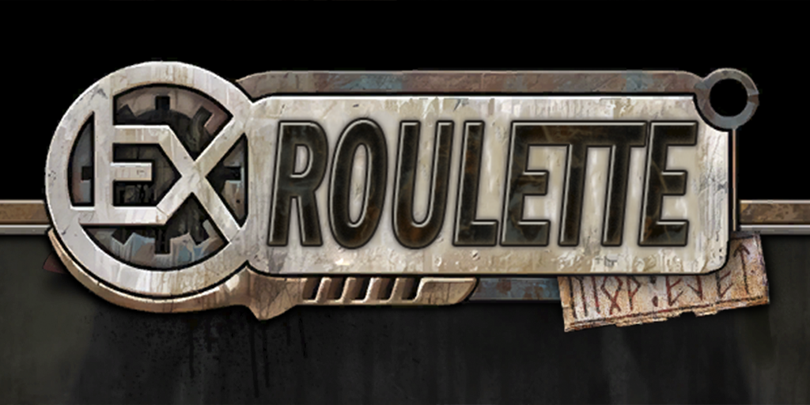
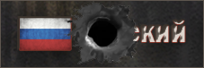
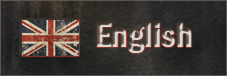
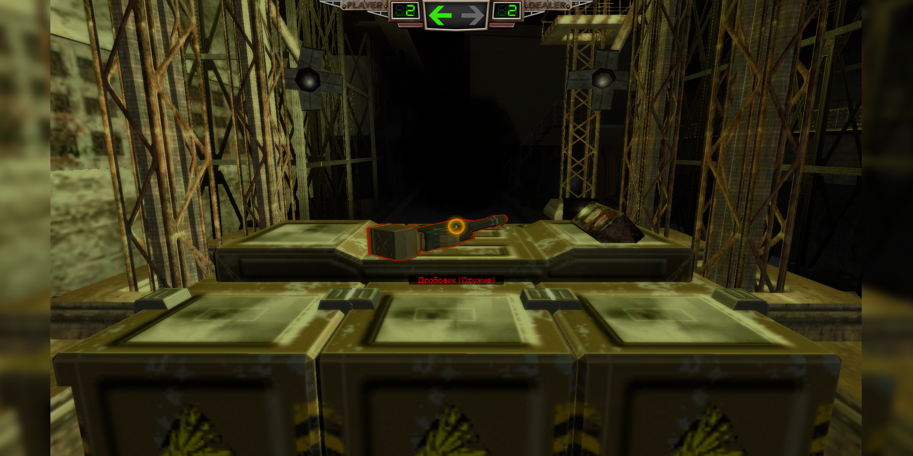
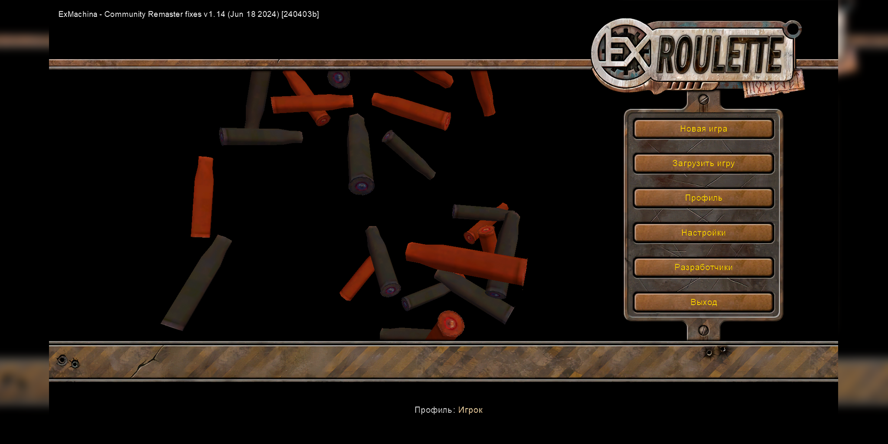
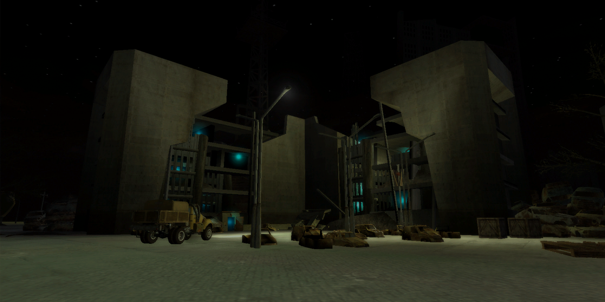
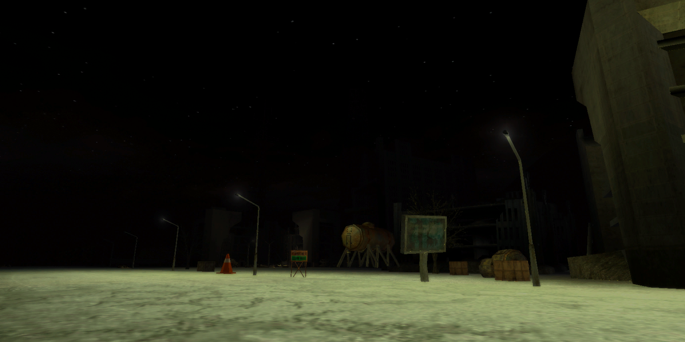
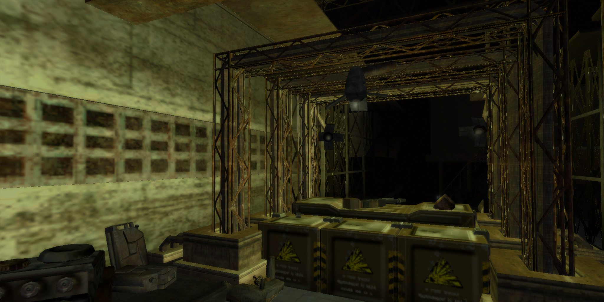

  

     

   
   
   
   

   
    
    
   

## Описание

**ExRoulette** представляет Вам новый геймплей в игре Ex Machina: где не нашлось места транспорту и городам, диалогам и сюжету. Мод почти полностью копирует игру [Buckshot Roulette от Mike Klubnika](https://store.steampowered.com/app/2835570/Buckshot_Roulette/).
 
> «Вы играете за путника, в чьих глазах жизнь утратила все краски и слово "смысл" лишь напоминает о славном прошлом. Теперь мир мёртв. Здесь живут неизвестные сущности, готовые играть с последними выжившими людьми в самые несправедливые игры.»

Действия разворачиваются в Мгновении, где властвуют свои правила.

-----------------------------------------------------------------------------------------------

## Скриншоты

> 
> Возьми его в руки и стреляй

> 
> Главное меню игры

> 
> Ночная дискотека душ

> 
> Пустое шоссе

> 
> Комната судьбоносных выборов

-----------------------------------------------------------------------------------------------

## Список изменений

- **Новый геймплей**
  - Почти полностью копирует игру Buckshot Roulette.

- **Новая карта**
  - "Мгновение" [*16х16*].

- **Новые музыка и звуки**
  - OST Buckshot Roulette.

- **3D Модели**
  - **Новые модели**: *дробовик, два пикселя;*
  - **Новые текстуры**: *картошке и гильзам.*

- **Изменённый интерфейс**
  - **Логотип игры** - *перерисован под логотип мода;*
  - **Картинки на загрузочный экран** - *несколько вариаций;*
  - **Радар** - *удалён;*
  - **Спидометр** - *удалён;*
  - **Прицел** - *упрощён под геймплей мода;*
  - **Здоровье, броня и топливо** - *переделаны под геймплей мода.*

-----------------------------------------------------------------------------------------------

## Установка

- Установка производится через [Community Mod Manager](https://github.com/Zvetkov/ComMod) (RU/ENG)
- Требуемая база: 1.14.1 [Community Remaster](https://github.com/DeusExMachinaTeam/EM-CommunityPatch) (RU/ENG) со всем опциональным контентом.

## [Скачать ExRoulette](https://github.com/ejetaxeblevich/ExRouletteMod/releases)

-----------------------------------------------------------------------------------------------

## Выражение благодарности

- **[Игре Buckshot Roulette](https://store.steampowered.com/app/2835570/Buckshot_Roulette/)**
- **[Короткометражному фильму по Buckshot Roulette](https://youtu.be/OCsJ4w1j8KA?si=1O9cjBgRlo7tWPAP)**
- **[Сообществу Deus Ex Machina](https://discord.gg/PVW57kr)**

### Отдельное спасибо

- **[Stakanyash](https://github.com/stakanyash)**
- **Mr Kirov**

А также всем и каждому, кто поиграл в этот мод!❤️
