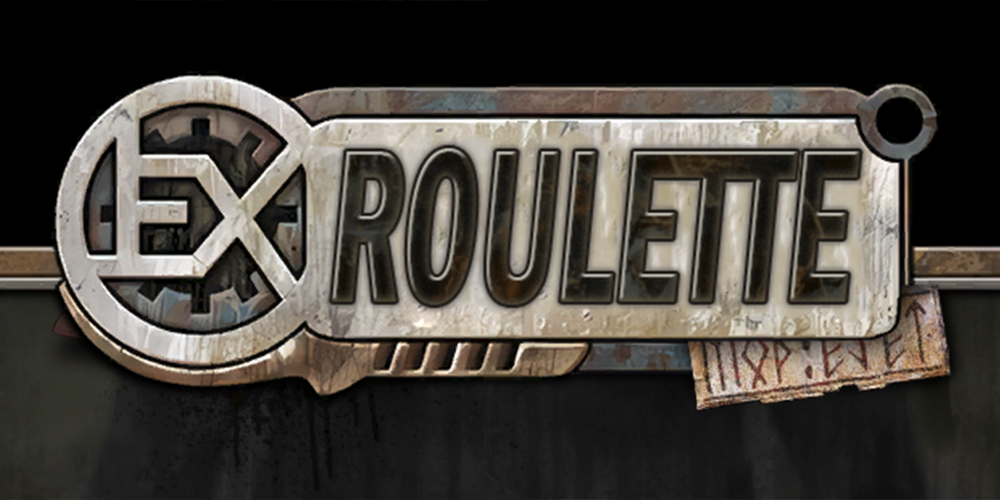
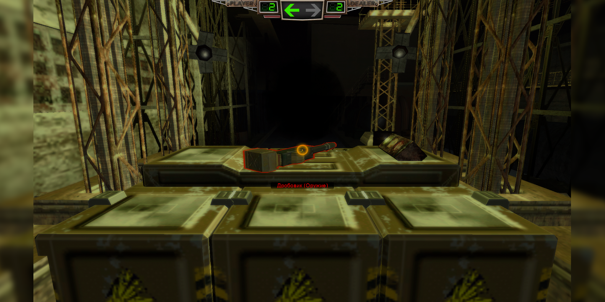
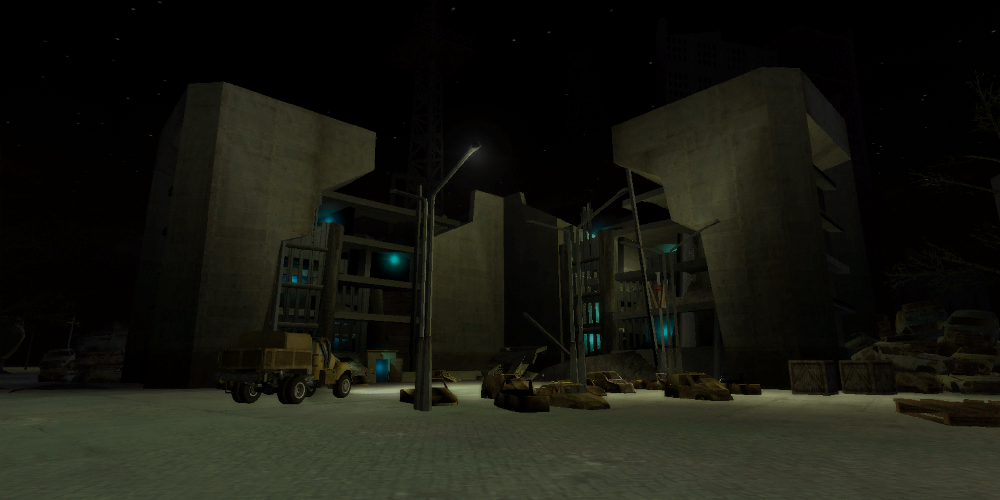

# ExRoulette Mod

  
   

-----------------------------------------------------------------------------------------------

**ExRoulette** представляет Вам новый геймплей в игре Ex Machina: где не нашлось места транспорту и городам, диалогам и сюжету. Мод почти полностью копирует игру [Buckshot Roulette от Mike Klubnika](https://store.steampowered.com/app/2835570/Buckshot_Roulette/).
 
> «Вы играете за путника, в чьих глазах жизнь утратила все краски и слово "смысл" лишь напоминает о славном прошлом. Теперь мир мёртв. Здесь живут неизвестные сущности, готовые играть с последними выжившими людьми в самые несправедливые игры.»

Действия разворачиваются в Мгновении, где властвуют свои правила.

-----------------------------------------------------------------------------------------------

### Установка:
- Установка производится через [Community Mod Manager](https://github.com/Zvetkov/ComMod) (RU/ENG)
- Требуемая база: 1.14.1 [Community Remaster](https://github.com/DeusExMachinaTeam/EM-CommunityPatch) (RU/ENG) со всем опциональным контентом.

### [Скачать ExRoulette](https://github.com/ejetaxeblevich/ExRouletteMod/releases)

-----------------------------------------------------------------------------------------------

### Скриншоты:

> 
> 
> 
> 
> 

-----------------------------------------------------------------------------------------------

### Список изменений:

- **Новый геймплей**
> Почти полностью копирует игру Buckshot Roulette.

- **Новая карта**
> "Мгновение" [*16х16*].

- **Новые музыка и звуки**
> OST Buckshot Roulette.

- **3D Модели**
> **Новые модели**: *дробовик, два пикселя;*

> **Новые текстуры**: *картошке и гильзам.*

- **Изменённый интерфейс**
> **Логотип игры** - *перерисован под логотип мода;*

> **Картинки на загрузочный экран** - *несколько вариаций;*

> **Радар** - *удалён;*

> **Спидометр** - *удалён;*

> **Прицел** - *упрощён под геймплей мода;*

> **Здоровье, броня и топливо** - *переделаны под геймплей мода.*

-----------------------------------------------------------------------------------------------

## Выражение благодарности:

- **[Игре Buckshot Roulette](https://store.steampowered.com/app/2835570/Buckshot_Roulette/)**
- **[Короткометражному фильму по Buckshot Roulette](https://youtu.be/OCsJ4w1j8KA?si=1O9cjBgRlo7tWPAP)**
- **[Сообществу Deus Ex Machina](https://discord.gg/PVW57kr)**

### Отдельное спасибо

- **[stakan](https://github.com/stakanyash)**
- **Mr Kirov**
