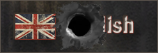
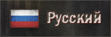

  
  
     

   
   
   
   

   
    
    
   

## Description

**ExRoulette** presents you a new gameplay in the game Hard Truck Apocalypse: where there was no place for transport and cities, dialogues and plot. The mod almost completely copies the [Buckshot Roulette by Mike Klubnika](https://store.steampowered.com/app/2835570/Buckshot_Roulette/).
 
> «You play as a traveler, in whose eyes life has lost all colors and the word "meaning" only reminds of the glorious past. Now the world is dead. Unknown entities live here, ready to play the most unfair games with the last surviving people.»

The action unfolds in an Instant, where rules prevail.

-----------------------------------------------------------------------------------------------

## Screenshots

> 
> Pick it up and shoot

> 
> The main menu of the game

> 
> Night souls disco

> 
> An empty highway

> 
> A fateful room for choose

-----------------------------------------------------------------------------------------------

## Changelog

- **New gameplay**
  - It almost completely copies the Buckshot Roulette game.

- **New level**
  - "Instant" [*16х16*].

- **New music and sounds**
  - OST Buckshot Roulette.

- **3D Models**
  - **New models**: *shotgun, two pixels;*
  - **New textures**: *potatoes and shell casings.*

- **Changed interface**
  - **The game's logo** - *has been redrawn to match the mod's logo;*
  - **Pictures on the loading screen** - *several variations;*
  - **Radar** - *deleted;*
  - **Speedometer** - *deleted;*
  - **Sight** - *simplified mod gameplay;*
  - **Health, armor and fuel** - *redesigned for mod gameplay.*

-----------------------------------------------------------------------------------------------

## Installation

- The installation is done via [Community Mod Manager](https://github.com/Zvetkov/ComMod) (RU/ENG)
- Required base: 1.14.1 [Community Remaster](https://github.com/DeusExMachinaTeam/EM-CommunityPatch) (RU/ENG) with all optional content.

## [Download ExRoulette](https://github.com/ejetaxeblevich/ExRouletteMod/releases)

-----------------------------------------------------------------------------------------------

## Expression of gratitude

- **[Buckshot Roulette game](https://store.steampowered.com/app/2835570/Buckshot_Roulette/)**
- **[A short film based on Buckshot Roulette](https://youtu.be/OCsJ4w1j8KA?si=1O9cjBgRlo7tWPAP)**
- **[Deus Ex Machina community](https://discord.gg/PVW57kr)**

### Special thanks

- **[Stakanyash](https://github.com/stakanyash)**
- **Mr Kirov**

And also to everyone who has played this mod!❤️
